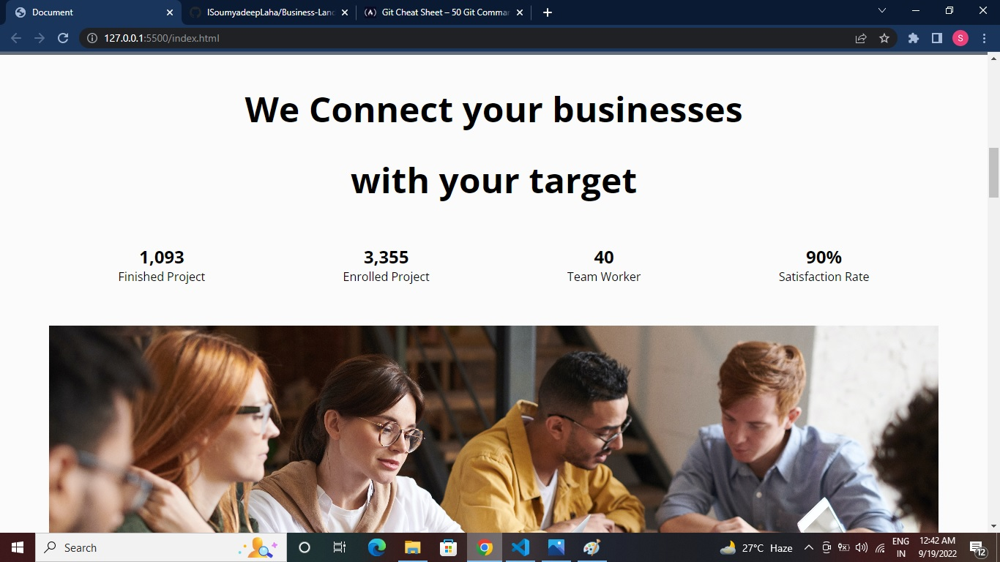
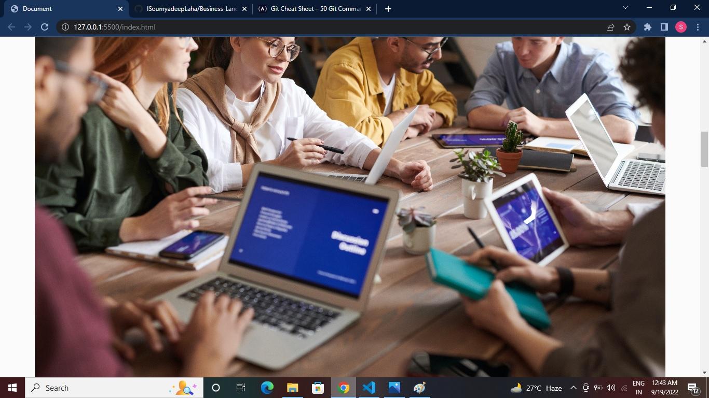
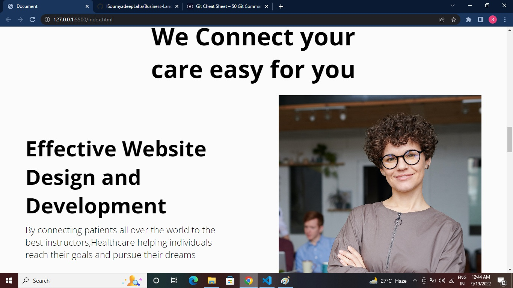
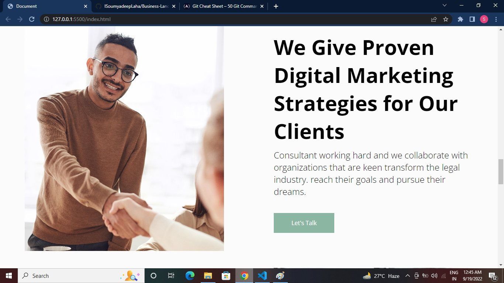
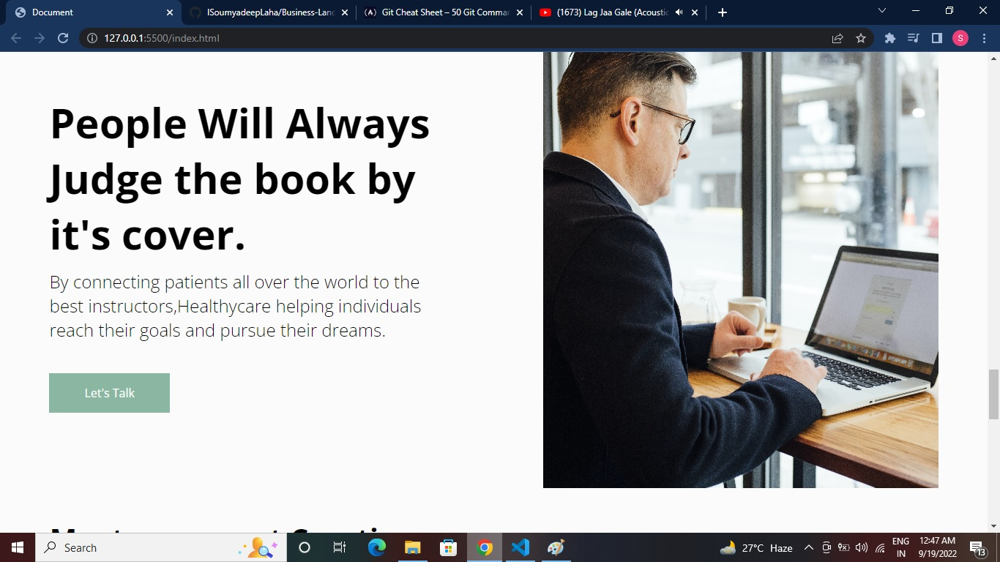
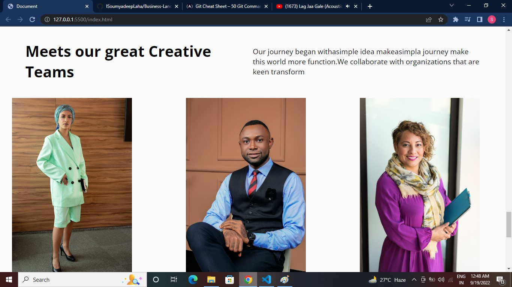
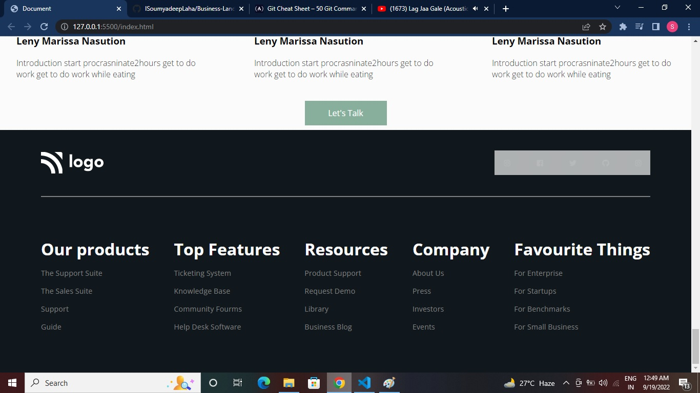

# Business Landing Page (Project 12)

By Soumyadeep Laha

# Key Learnings

- In-depth knowledge of how to use flexbox to make responsive pages.
- How to give values in more presize ways by using rem and percentages and some shortcuts tricks in flexbox.

# Time to complete the project

It almost tooked 4 hrs 10 mins

# Screen Sorts

# Live Link

[Netlify Live...](https://business-landing-page-proj12-sl.netlify.app/)